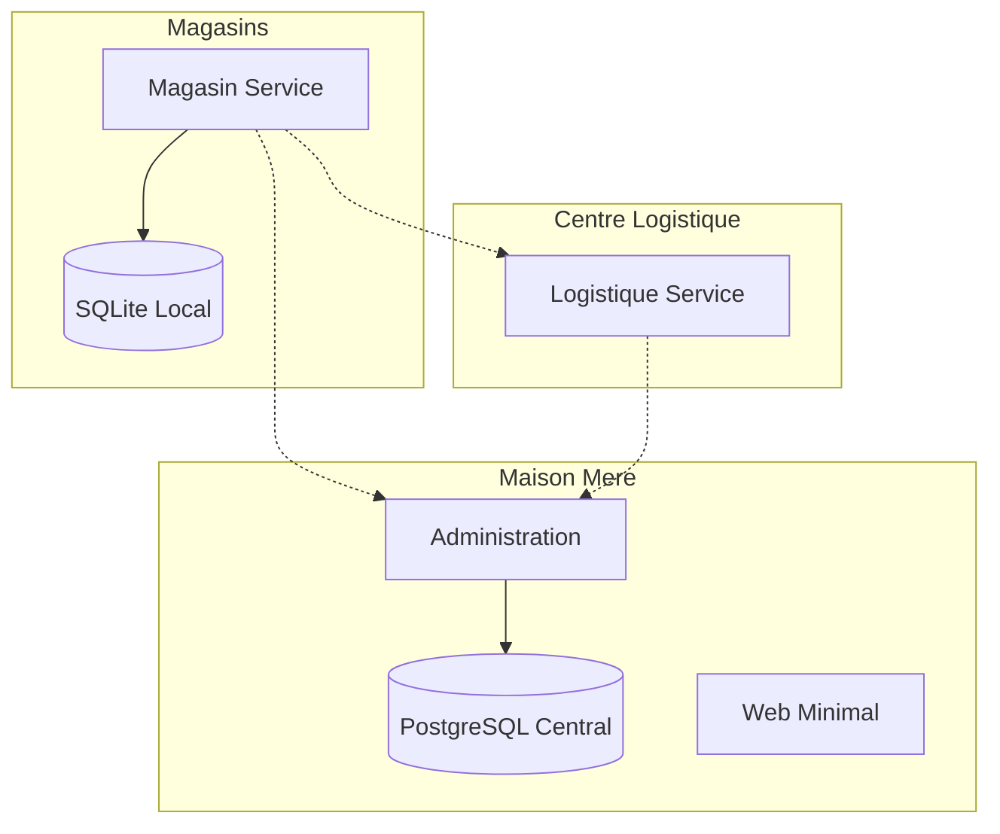

## Diagramme de deploiement

```mermaid
graph TB
    subgraph MM["Maison Mere"]
        postgres[(PostgreSQL Central)]
        administration[Administration]
        web[Web Minimal]
    end
    
    subgraph MAG["Magasins"]
        sqlite[(SQLite Local)]
        magasin[Magasin Service]
        magasin --> sqlite
    end

    subgraph LOG["Centre Logistique"]
        logistique[Logistique Service]
    end
 
    %% Communication reseau
    magasin -.-> administration
    magasin -.-> logistique
    logistique -.-> administration
    administration --> postgres
``` 