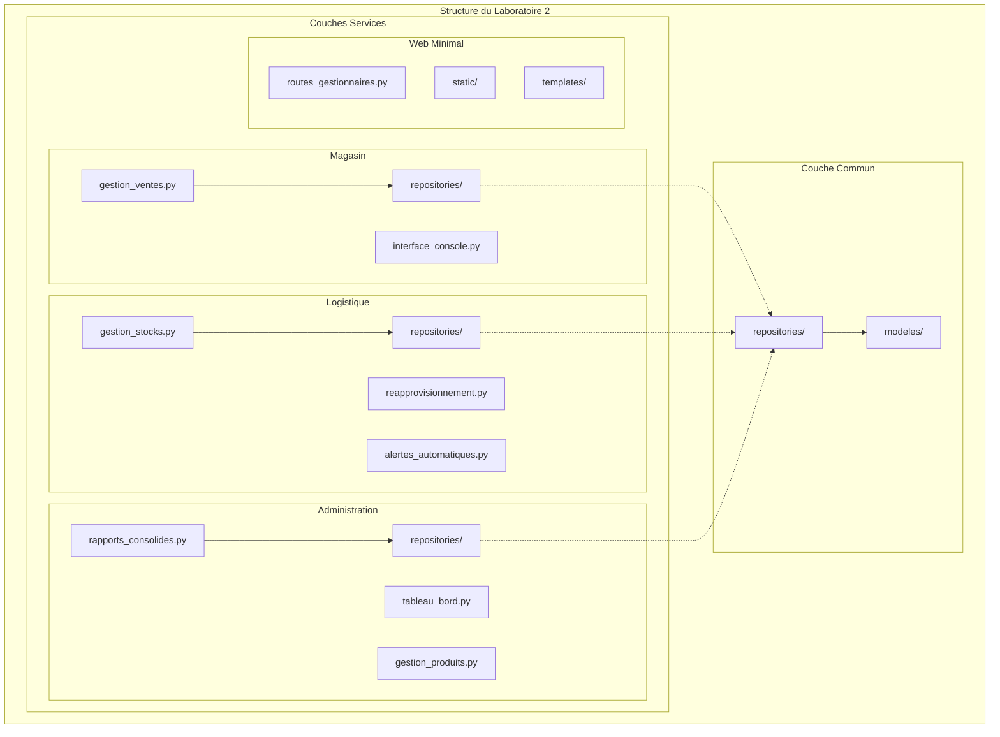

# Diagramme d'implementation

## Structure du Laboratoire 2

### Couches Logiciels

**1. Couche Presentation:**
- Interface Console : Interaction employes magasin (Python CLI)
- Interface Web : Dashboard gestionnaires (HTML/CSS/JS templates)
- API REST : Endpoints services pour communication inter-services

**2. Couche Application (Services):**
- magasin-service : Logique ventes locales, gestion caisses
- logistique-service : Logique stocks, reapprovisionnement, alertes
- administration-service : Logique rapports, consolidation, gestion produits

**3. Couche Repository (Patron):**
- Interfaces Repository : Abstraction acces donnees (ProductRepository, VenteRepository)
- Implementations : Repository concrets pour local (SQLite) et central (PostgreSQL)

**4. Couche Persistance:**
- PostgreSQL Central : Catalogue produits, rapports consolides, configuration
- SQLite Local : Ventes quotidiennes, stocks magasin

### Dependances
- Synchrone : API REST pour requetes directes (UC1, UC2, UC3)
- Asynchrone : HTTP Webhooks pour evenements (UC7 alertes)

### Technologies d'Implementation
- Docker : Conteneurisation services
- PostgreSQL 15 : Base centrale (catalogue, rapports)
- SQLite 3 : Bases locales par magasin (autonomie)
- SQLAlchemy : ORM pour abstraction base de donnees
- pytest : Tests unitaires et integration
- GitHub Actions : Pipeline CI/CD automatisee
