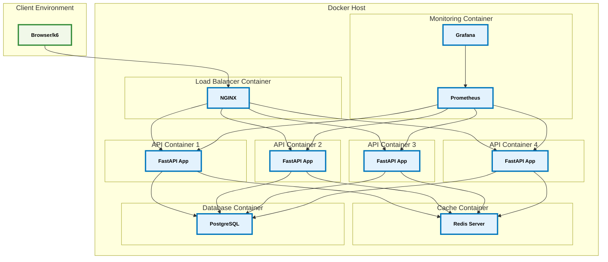

# Diagramme de Deploiement

```mermaid
graph TB
    subgraph DockerHost["Docker Host"]
        subgraph LBContainer["Load Balancer Container"]
            NGINX[NGINX]
        end
        
        subgraph APIContainer1["API Container 1"]
            API1[FastAPI App]
        end
        
        subgraph APIContainer2["API Container 2"]
            API2[FastAPI App]
        end
        
        subgraph APIContainer3["API Container 3"]
            API3[FastAPI App]
        end
        
        subgraph APIContainer4["API Container 4"]
            API4[FastAPI App]
        end
        
        subgraph CacheContainer["Cache Container"]
            Redis[Redis Server]
        end
        
        subgraph DatabaseContainer["Database Container"]
            PostgreSQL[PostgreSQL]
        end
        
        subgraph MonitoringContainer["Monitoring Container"]
            Prometheus[Prometheus]
            Grafana[Grafana]
        end
    end
    
    subgraph ClientEnv["Client Environment"]
        Client[Browser/k6]
    end
    
    Client --> NGINX
    NGINX --> API1
    NGINX --> API2
    NGINX --> API3
    NGINX --> API4
    API1 --> Redis
    API2 --> Redis
    API3 --> Redis
    API4 --> Redis
    API1 --> PostgreSQL
    API2 --> PostgreSQL
    API3 --> PostgreSQL
    API4 --> PostgreSQL
    Prometheus --> API1
    Prometheus --> API2
    Prometheus --> API3
    Prometheus --> API4
    Grafana --> Prometheus
    
    classDef container fill:#e3f2fd,stroke:#0277bd,stroke-width:3px,color:#000000,font-size:12px,font-weight:bold
    classDef client fill:#f1f8e9,stroke:#388e3c,stroke-width:3px,color:#000000,font-size:12px,font-weight:bold
    
    class NGINX,API1,API2,API3,API4,Redis,PostgreSQL,Prometheus,Grafana container
    class Client client
```