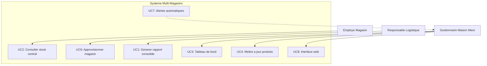

## Diagramme de cas d'utilisation

## Cas d'utilisation

**Acteurs:**
- Employe Magasin : Consulte les stocks, fait les demandes de reapprovisionnement
- Gestionnaire Maison Mere : Genere des rapports, supervise les performances, gere les produits
- Responsable Logistique : Valide et traite les approvisionnements entre entrepot et magasins

**Cas d'utilisation principaux:**

*Must Have:*
- UC1 : Generer un rapport consolide des ventes par magasin
- UC2 : Consulter le stock central et declencher un reapprovisionnement
- UC3 : Visualiser les performances dans un tableau de bord

*Should Have:*
- UC4 : Mettre a jour les produits depuis la maison mere
- UC6 : Approvisionner un magasin depuis le centre logistique

*Could Have:*
- UC7 : Alerter automatiquement en cas de rupture critique
- UC8 : Interface web minimale pour les gestionnaires

**Contraintes**
- Coherence des donnees : Synchronisation entre magasins et maison mere
- Temps reel : Les alertes doivent etre transmises rapidement
- Autonomie locale : Les magasins doivent fonctionner meme en cas de panne reseau