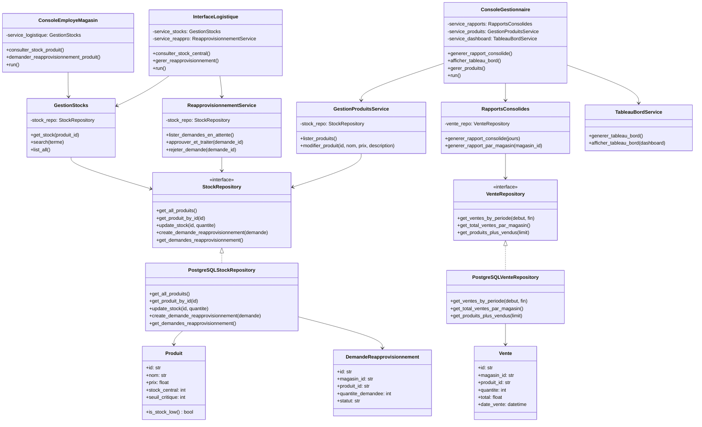
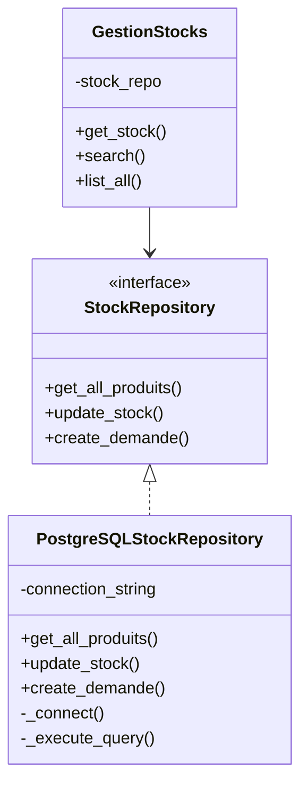

# Diagramme de Classes

## Architecture Principale

```mermaid
classDiagram
    %% Domain
    class Produit {
        +id: str
        +nom: str
        +prix: float
        +stock_central: int
        +seuil_critique: int
        +is_stock_low() bool
    }

    class Vente {
        +id: str
        +magasin_id: str
        +produit_id: str
        +quantite: int
        +total: float
        +date_vente: datetime
    }

    class DemandeReapprovisionnement {
        +id: str
        +magasin_id: str
        +produit_id: str
        +quantite_demandee: int
        +statut: str
    }

    %% Repository Interfaces
    class StockRepository {
        <<interface>>
        +get_all_produits()
        +get_produit_by_id(id)
        +update_stock(id, quantite)
        +create_demande_reapprovisionnement(demande)
        +get_demandes_reapprovisionnement()
    }

    class VenteRepository {
        <<interface>>
        +get_ventes_by_periode(debut, fin)
        +get_total_ventes_par_magasin()
        +get_produits_plus_vendus(limit)
    }

    %% Repository Implementations
    class PostgreSQLStockRepository {
        +get_all_produits()
        +get_produit_by_id(id)
        +update_stock(id, quantite)
        +create_demande_reapprovisionnement(demande)
        +get_demandes_reapprovisionnement()
    }

    class PostgreSQLVenteRepository {
        +get_ventes_by_periode(debut, fin)
        +get_total_ventes_par_magasin()
        +get_produits_plus_vendus(limit)
    }

    %% Services
    class GestionStocks {
        -stock_repo: StockRepository
        +get_stock(produit_id)
        +search(terme)
        +list_all()
    }

    class RapportsConsolides {
        -vente_repo: VenteRepository
        +generer_rapport_consolide(jours)
        +generer_rapport_par_magasin(magasin_id)
    }

    class ReapprovisionnementService {
        -stock_repo: StockRepository
        +lister_demandes_en_attente()
        +approuver_et_traiter(demande_id)
        +rejeter_demande(demande_id)
    }

    class GestionProduitsService {
        -stock_repo: StockRepository
        +lister_produits()
        +modifier_produit(id, nom, prix, description)
    }

    class TableauBordService {
        +generer_tableau_bord()
        +afficher_tableau_bord(dashboard)
    }

    %% Interfaces
    class ConsoleEmployeMagasin {
        -service_logistique: GestionStocks
        +consulter_stock_produit()
        +demander_reapprovisionnement_produit()
        +run()
    }

    class ConsoleGestionnaire {
        -service_rapports: RapportsConsolides
        -service_produits: GestionProduitsService
        -service_dashboard: TableauBordService
        +generer_rapport_consolide()
        +afficher_tableau_bord()
        +gerer_produits()
        +run()
    }

    class InterfaceLogistique {
        -service_stocks: GestionStocks
        -service_reappro: ReapprovisionnementService
        +consulter_stock_central()
        +gerer_reapprovisionnement()
        +run()
    }

    %% Relationships
    StockRepository <|.. PostgreSQLStockRepository
    VenteRepository <|.. PostgreSQLVenteRepository

    GestionStocks --> StockRepository
    RapportsConsolides --> VenteRepository
    ReapprovisionnementService --> StockRepository
    GestionProduitsService --> StockRepository

    ConsoleEmployeMagasin --> GestionStocks
    ConsoleGestionnaire --> RapportsConsolides
    ConsoleGestionnaire --> GestionProduitsService
    ConsoleGestionnaire --> TableauBordService
    InterfaceLogistique --> GestionStocks
    InterfaceLogistique --> ReapprovisionnementService

    PostgreSQLStockRepository --> Produit
    PostgreSQLStockRepository --> DemandeReapprovisionnement
    PostgreSQLVenteRepository --> Vente
```

## Patron Repository

```mermaid
classDiagram
    class StockRepository {
        <<interface>>
        +get_all_produits()
        +update_stock()
        +create_demande()
    }

    class PostgreSQLStockRepository {
        -connection_string
        +get_all_produits()
        +update_stock()
        +create_demande()
        -_connect()
        -_execute_query()
    }

    class GestionStocks {
        -stock_repo
        +get_stock()
        +search()
        +list_all()
    }

    StockRepository <|.. PostgreSQLStockRepository
    GestionStocks --> StockRepository
```
