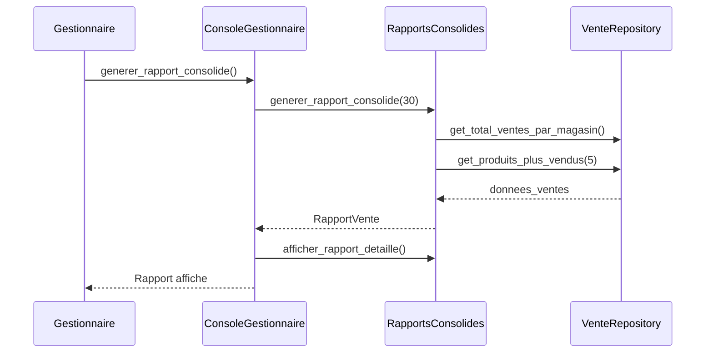
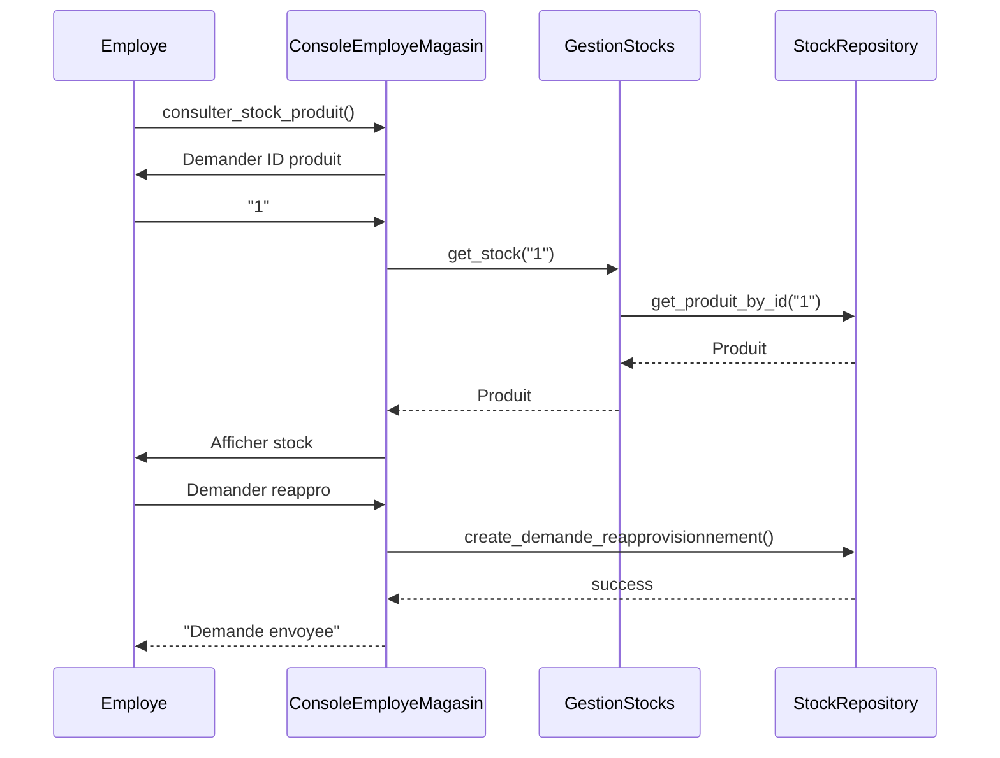
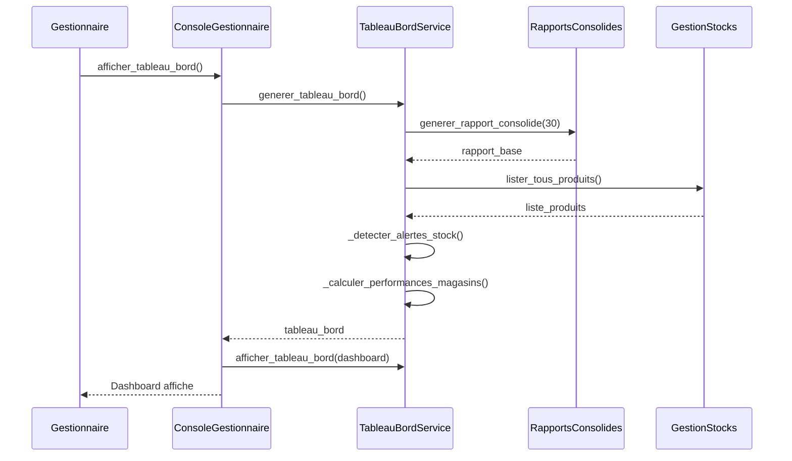
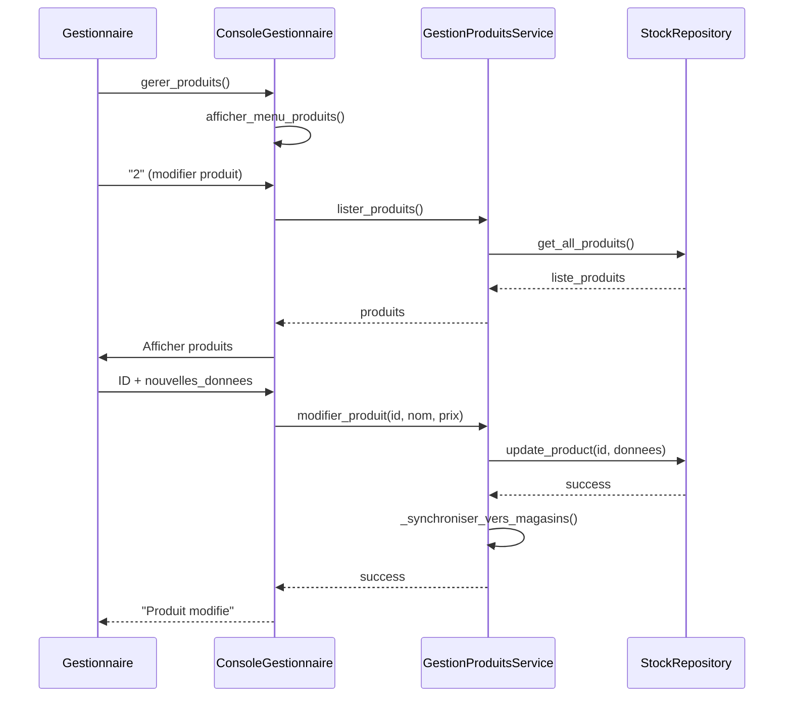
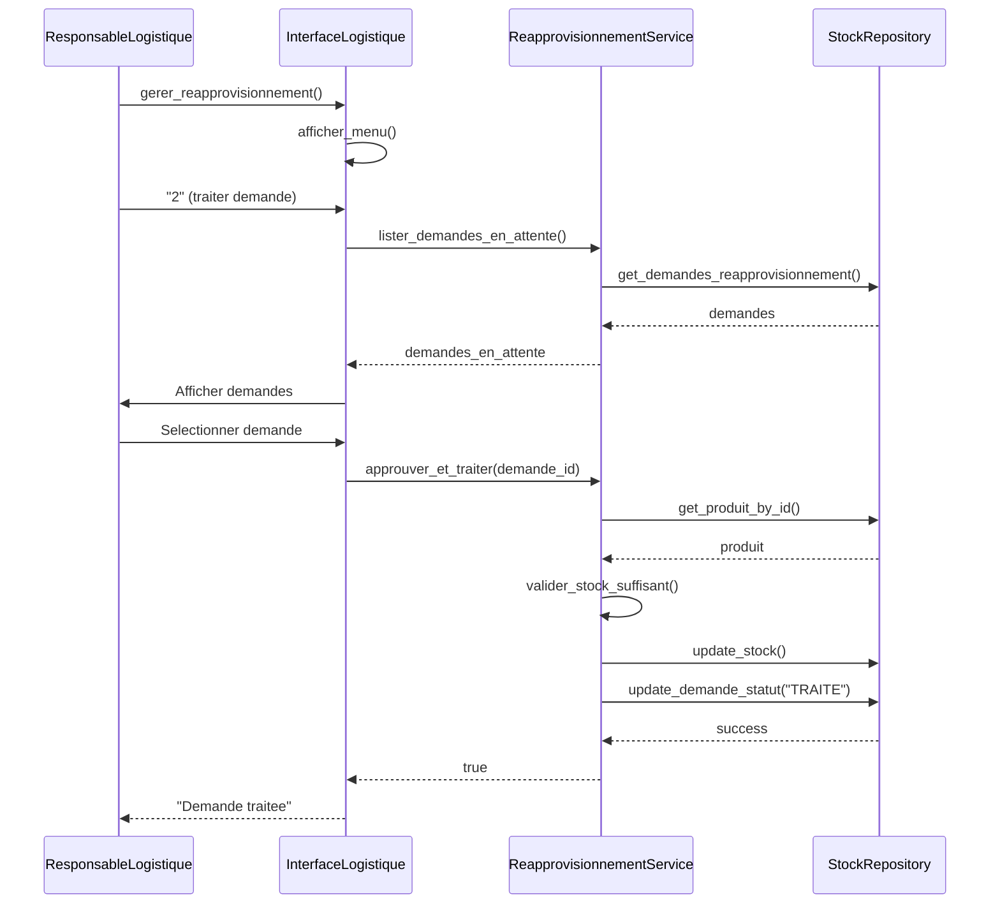

# Diagramme de Sequence - pour UC1 a UC6

## UC1: Generation Rapport

## UC2: Consultation Stock et Demande Reapprovisionnement

## UC3: Tableau de Bord

## UC4: Modification Produit

## UC6: Traitement Reapprovisionnement

