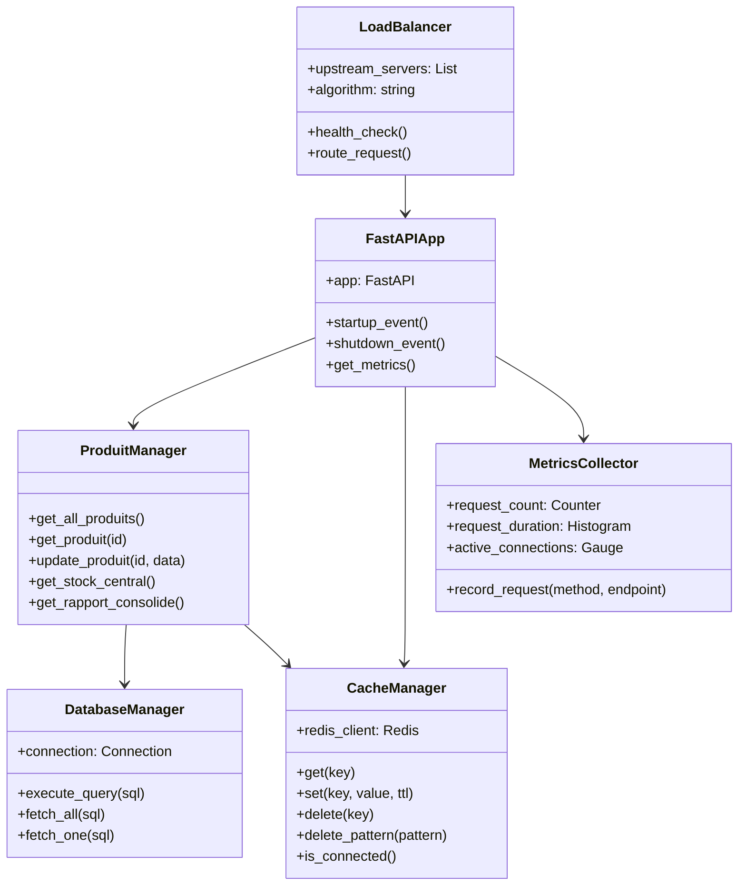

# Diagramme de Classes

```mermaid
classDiagram
    class FastAPIApp {
        +app: FastAPI
        +startup_event()
        +shutdown_event()
        +get_metrics()
    }
    
    class ProduitManager {
        +get_all_produits()
        +get_produit(id)
        +update_produit(id, data)
        +get_stock_central()
        +get_rapport_consolide()
    }
    
    class CacheManager {
        +redis_client: Redis
        +get(key)
        +set(key, value, ttl)
        +delete(key)
        +delete_pattern(pattern)
        +is_connected()
    }
    
    class DatabaseManager {
        +connection: Connection
        +execute_query(sql)
        +fetch_all(sql)
        +fetch_one(sql)
    }
    
    class MetricsCollector {
        +request_count: Counter
        +request_duration: Histogram
        +active_connections: Gauge
        +record_request(method, endpoint)
    }
    
    class LoadBalancer {
        +upstream_servers: List
        +algorithm: string
        +health_check()
        +route_request()
    }
    
    FastAPIApp --> ProduitManager
    FastAPIApp --> CacheManager
    FastAPIApp --> MetricsCollector
    ProduitManager --> DatabaseManager
    ProduitManager --> CacheManager
    LoadBalancer --> FastAPIApp
```