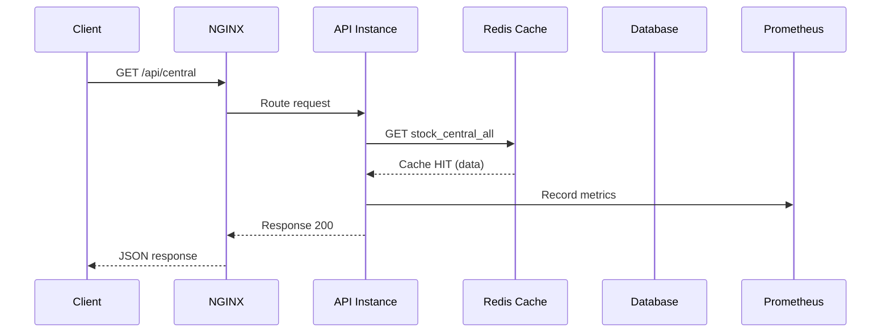
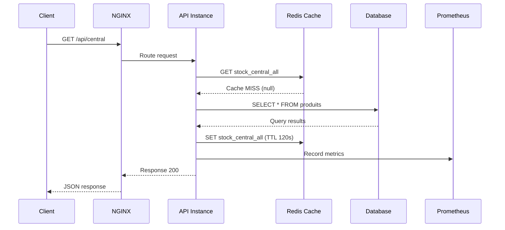
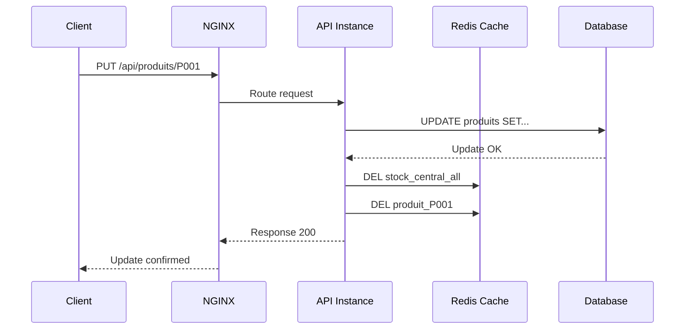

# Diagramme de Sequence

## Sequence avec Cache Hit

```mermaid
sequenceDiagram
    participant C as Client
    participant N as NGINX
    participant A as API Instance
    participant R as Redis Cache
    participant DB as Database
    participant P as Prometheus
    
    C->>N: GET /api/central
    N->>A: Route request
    A->>R: GET stock_central_all
    R-->>A: Cache HIT (data)
    A->>P: Record metrics
    A-->>N: Response 200
    N-->>C: JSON response
```

## Sequence avec Cache Miss

```mermaid
sequenceDiagram
    participant C as Client
    participant N as NGINX
    participant A as API Instance
    participant R as Redis Cache
    participant DB as Database
    participant P as Prometheus
    
    C->>N: GET /api/central
    N->>A: Route request
    A->>R: GET stock_central_all
    R-->>A: Cache MISS (null)
    A->>DB: SELECT * FROM produits
    DB-->>A: Query results
    A->>R: SET stock_central_all (TTL 120s)
    A->>P: Record metrics
    A-->>N: Response 200
    N-->>C: JSON response
```

## Sequence Invalidation Cache

```mermaid
sequenceDiagram
    participant C as Client
    participant N as NGINX
    participant A as API Instance
    participant R as Redis Cache
    participant DB as Database
    
    C->>N: PUT /api/produits/P001
    N->>A: Route request
    A->>DB: UPDATE produits SET...
    DB-->>A: Update OK
    A->>R: DEL stock_central_all
    A->>R: DEL produit_P001
    A-->>N: Response 200
    N-->>C: Update confirmed
```