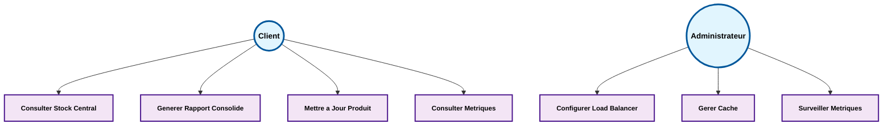

# Diagramme de Cas d'Utilisation

```mermaid
graph TD
    Client((Client))
    Admin((Administrateur))
    
    ConsulterStock[Consulter Stock Central]
    GenererRapport[Generer Rapport Consolide]
    MettreAJourProduit[Mettre a Jour Produit]
    ConsulterMetriques[Consulter Metriques]
    
    ConfigurerLB[Configurer Load Balancer]
    GererCache[Gerer Cache]
    SurveillerMetriques[Surveiller Metriques]
    
    Client --> ConsulterStock
    Client --> GenererRapport
    Client --> MettreAJourProduit
    Client --> ConsulterMetriques
    
    Admin --> ConfigurerLB
    Admin --> GererCache
    Admin --> SurveillerMetriques
    
    classDef actor fill:#e1f5fe,stroke:#01579b,stroke-width:3px,color:#000000,font-size:14px,font-weight:bold
    classDef usecase fill:#f3e5f5,stroke:#4a148c,stroke-width:2px,color:#000000,font-size:12px,font-weight:bold
    
    class Client,Admin actor
    class ConsulterStock,GenererRapport,MettreAJourProduit,ConsulterMetriques,ConfigurerLB,GererCache,SurveillerMetriques usecase
```