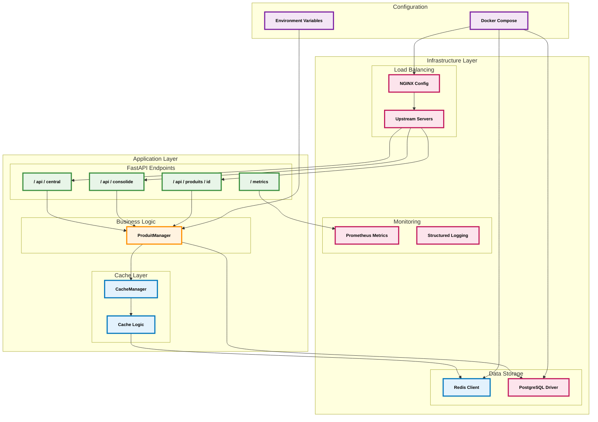

# Diagramme d'Implementation

```mermaid
graph TB
    subgraph AppLayer["Application Layer"]
        subgraph Endpoints["FastAPI Endpoints"]
            E1["/ api / central"]
            E2["/ api / consolide"]
            E3["/ api / produits / id"]
            E4["/ metrics"]
        end
        
        subgraph Business["Business Logic"]
            BL[ProduitManager]
        end
        
        subgraph Cache["Cache Layer"]
            CM[CacheManager]
            CL[Cache Logic]
        end
    end
    
    subgraph InfraLayer["Infrastructure Layer"]
        subgraph LoadBalancing["Load Balancing"]
            LB[NGINX Config]
            UP[Upstream Servers]
        end
        
        subgraph DataStorage["Data Storage"]
            RC[Redis Client]
            DB[PostgreSQL Driver]
        end
        
        subgraph Monitoring["Monitoring"]
            MT[Prometheus Metrics]
            LG[Structured Logging]
        end
    end
    
    subgraph Config["Configuration"]
        DC[Docker Compose]
        ENV[Environment Variables]
    end
    
    E1 --> BL
    E2 --> BL
    E3 --> BL
    E4 --> MT
    
    BL --> CM
    BL --> DB
    CM --> CL
    CL --> RC
    
    LB --> UP
    UP --> E1
    UP --> E2
    UP --> E3
    
    DC --> LB
    DC --> RC
    DC --> DB
    ENV --> BL
    
    classDef endpoint fill:#e8f5e8,stroke:#388e3c,stroke-width:3px,color:#000000,font-size:12px,font-weight:bold
    classDef business fill:#fff3e0,stroke:#ff8f00,stroke-width:3px,color:#000000,font-size:12px,font-weight:bold
    classDef cache fill:#e3f2fd,stroke:#0277bd,stroke-width:3px,color:#000000,font-size:12px,font-weight:bold
    classDef infra fill:#fce4ec,stroke:#c2185b,stroke-width:3px,color:#000000,font-size:12px,font-weight:bold
    classDef config fill:#f3e5f5,stroke:#7b1fa2,stroke-width:3px,color:#000000,font-size:12px,font-weight:bold
    
    class E1,E2,E3,E4 endpoint
    class BL business
    class CM,CL,RC cache
    class LB,UP,DB,MT,LG infra
    class DC,ENV config
```