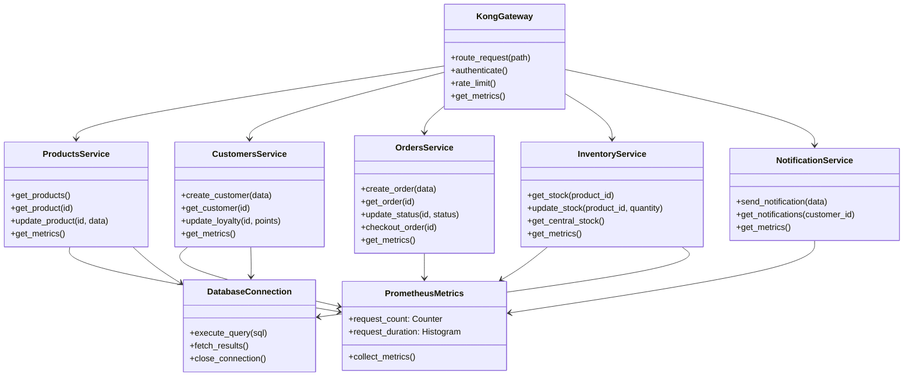

# Diagramme de Classes

```mermaid
classDiagram
    class ProductsService {
        +get_products()
        +get_product(id)
        +update_product(id, data)
        +get_metrics()
    }
    
    class CustomersService {
        +create_customer(data)
        +get_customer(id)
        +update_loyalty(id, points)
        +get_metrics()
    }
    
    class OrdersService {
        +create_order(data)
        +get_order(id)
        +update_status(id, status)
        +checkout_order(id)
        +get_metrics()
    }
    
    class InventoryService {
        +get_stock(product_id)
        +update_stock(product_id, quantity)
        +get_central_stock()
        +get_metrics()
    }
    
    class NotificationService {
        +send_notification(data)
        +get_notifications(customer_id)
        +get_metrics()
    }
    
    class KongGateway {
        +route_request(path)
        +authenticate()
        +rate_limit()
        +get_metrics()
    }
    
    class PrometheusMetrics {
        +request_count: Counter
        +request_duration: Histogram
        +collect_metrics()
    }
    
    class DatabaseConnection {
        +execute_query(sql)
        +fetch_results()
        +close_connection()
    }
    
    KongGateway --> ProductsService
    KongGateway --> CustomersService
    KongGateway --> OrdersService
    KongGateway --> InventoryService
    KongGateway --> NotificationService
    
    ProductsService --> PrometheusMetrics
    CustomersService --> PrometheusMetrics
    OrdersService --> PrometheusMetrics
    InventoryService --> PrometheusMetrics
    NotificationService --> PrometheusMetrics
    
    ProductsService --> DatabaseConnection
    CustomersService --> DatabaseConnection
    InventoryService --> DatabaseConnection
```