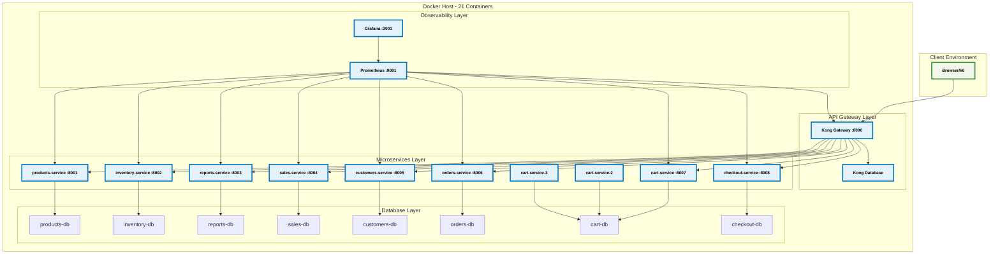

# Diagramme de Deploiement

```mermaid
graph TB
    subgraph DockerHost["Docker Host - 21 Containers"]
        subgraph GatewayLayer["API Gateway Layer"]
            Kong[Kong Gateway :8000]
            KongDB[Kong Database]
        end
        
        subgraph ServiceLayer["Microservices Layer"]
            ProductsAPI[products-service :8001]
            InventoryAPI[inventory-service :8002]
            ReportsAPI[reports-service :8003]
            SalesAPI[sales-service :8004]
            CustomersAPI[customers-service :8005]
            OrdersAPI[orders-service :8006]
            CartAPI[cart-service :8007]
            CartAPI2[cart-service-2]
            CartAPI3[cart-service-3]
            CheckoutAPI[checkout-service :8008]
        end
        
        subgraph DatabaseLayer["Database Layer"]
            ProductsDB[products-db]
            InventoryDB[inventory-db]
            ReportsDB[reports-db]
            SalesDB[sales-db]
            CustomersDB[customers-db]
            OrdersDB[orders-db]
            CartDB[cart-db]
            CheckoutDB[checkout-db]
        end
        
        subgraph MonitoringLayer["Observability Layer"]
            Prometheus[Prometheus :9091]
            Grafana[Grafana :3001]
        end
    end
    
    subgraph ClientEnv["Client Environment"]
        Client[Browser/k6]
    end
    
    Client --> Kong
    Kong --> ProductsAPI
    Kong --> InventoryAPI
    Kong --> ReportsAPI
    Kong --> SalesAPI
    Kong --> CustomersAPI
    Kong --> OrdersAPI
    Kong --> CartAPI
    Kong --> CheckoutAPI
    
    ProductsAPI --> ProductsDB
    InventoryAPI --> InventoryDB
    ReportsAPI --> ReportsDB
    SalesAPI --> SalesDB
    CustomersAPI --> CustomersDB
    OrdersAPI --> OrdersDB
    CartAPI --> CartDB
    CartAPI2 --> CartDB
    CartAPI3 --> CartDB
    CheckoutAPI --> CheckoutDB
    Kong --> KongDB
    
    Prometheus --> ProductsAPI
    Prometheus --> InventoryAPI
    Prometheus --> ReportsAPI
    Prometheus --> SalesAPI
    Prometheus --> CustomersAPI
    Prometheus --> OrdersAPI
    Prometheus --> CartAPI
    Prometheus --> CheckoutAPI
    Prometheus --> Kong
    Grafana --> Prometheus
    
    classDef container fill:#e3f2fd,stroke:#0277bd,stroke-width:3px,color:#000000,font-size:12px,font-weight:bold
    classDef client fill:#f1f8e9,stroke:#388e3c,stroke-width:3px,color:#000000,font-size:12px,font-weight:bold
    
    class Kong,ProductsAPI,InventoryAPI,ReportsAPI,SalesAPI,CustomersAPI,OrdersAPI,CartAPI,CartAPI2,CartAPI3,CheckoutAPI,Prometheus,Grafana,KongDB container
    class Client client
```