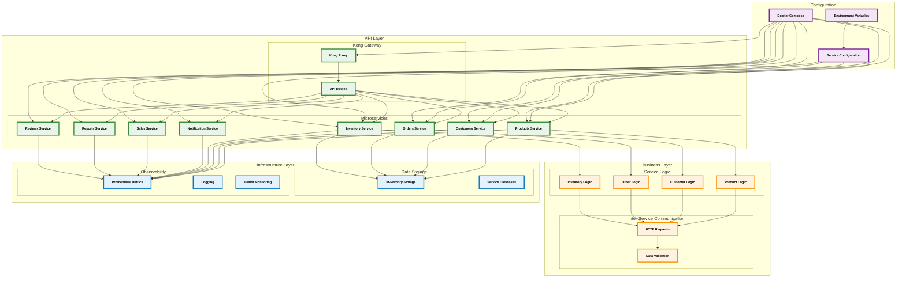

# Diagramme d'Implementation

```mermaid
graph TB
    subgraph APILayer["API Layer"]
        subgraph Gateway["Kong Gateway"]
            GW[Kong Proxy]
            AR[API Routes]
        end
        
        subgraph Microservices["Microservices"]
            MS1[Products Service]
            MS2[Customers Service]
            MS3[Orders Service]
            MS4[Inventory Service]
            MS5[Notification Service]
            MS6[Sales Service]
            MS7[Reports Service]
            MS8[Reviews Service]
        end
    end
    
    subgraph BusinessLayer["Business Layer"]
        subgraph ServiceLogic["Service Logic"]
            PL[Product Logic]
            CL[Customer Logic]
            OL[Order Logic]
            IL[Inventory Logic]
        end
        
        subgraph Communication["Inter-Service Communication"]
            HTTP[HTTP Requests]
            VAL[Data Validation]
        end
    end
    
    subgraph InfraLayer["Infrastructure Layer"]
        subgraph Storage["Data Storage"]
            MemDB[In-Memory Storage]
            SDB[Service Databases]
        end
        
        subgraph Monitoring["Observability"]
            PM[Prometheus Metrics]
            LG[Logging]
            HM[Health Monitoring]
        end
    end
    
    subgraph Config["Configuration"]
        DC[Docker Compose]
        ENV[Environment Variables]
        CF[Service Configuration]
    end
    
    GW --> AR
    AR --> MS1
    AR --> MS2
    AR --> MS3
    AR --> MS4
    AR --> MS5
    AR --> MS6
    AR --> MS7
    AR --> MS8
    
    MS1 --> PL
    MS2 --> CL
    MS3 --> OL
    MS4 --> IL
    
    PL --> HTTP
    CL --> HTTP
    OL --> HTTP
    IL --> HTTP
    
    HTTP --> VAL
    
    MS1 --> MemDB
    MS2 --> MemDB
    MS3 --> MemDB
    MS4 --> MemDB
    
    MS1 --> PM
    MS2 --> PM
    MS3 --> PM
    MS4 --> PM
    MS5 --> PM
    MS6 --> PM
    MS7 --> PM
    MS8 --> PM
    
    DC --> GW
    DC --> MS1
    DC --> MS2
    DC --> MS3
    DC --> MS4
    DC --> MS5
    DC --> MS6
    DC --> MS7
    DC --> MS8
    
    ENV --> CF
    CF --> MS1
    CF --> MS2
    CF --> MS3
    CF --> MS4
    
    classDef api fill:#e8f5e8,stroke:#388e3c,stroke-width:3px,color:#000000,font-size:12px,font-weight:bold
    classDef business fill:#fff3e0,stroke:#ff8f00,stroke-width:3px,color:#000000,font-size:12px,font-weight:bold
    classDef infra fill:#e3f2fd,stroke:#0277bd,stroke-width:3px,color:#000000,font-size:12px,font-weight:bold
    classDef config fill:#f3e5f5,stroke:#7b1fa2,stroke-width:3px,color:#000000,font-size:12px,font-weight:bold
    
    class GW,AR,MS1,MS2,MS3,MS4,MS5,MS6,MS7,MS8 api
    class PL,CL,OL,IL,HTTP,VAL business
    class MemDB,SDB,PM,LG,HM infra
    class DC,ENV,CF config
```