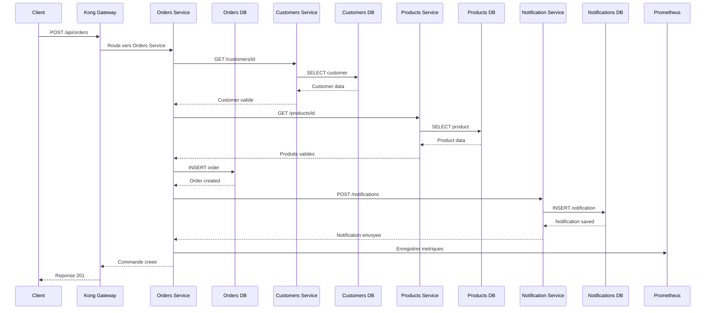
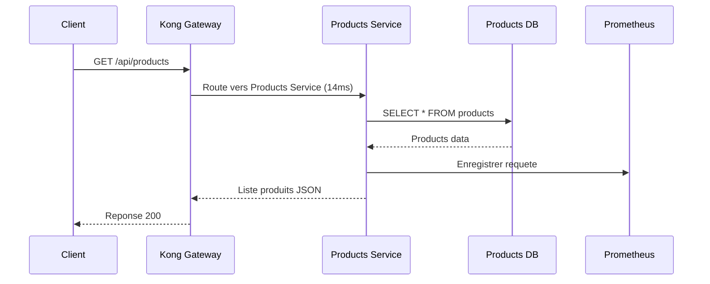
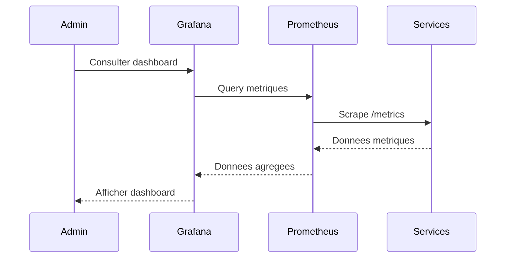

# Diagramme de Sequence

## Sequence Creation Commande avec PostgreSQL

```mermaid
sequenceDiagram
    participant C as Client
    participant K as Kong Gateway
    participant O as Orders Service
    participant ODB as Orders DB
    participant CU as Customers Service
    participant CUDB as Customers DB
    participant P as Products Service
    participant PDB as Products DB
    participant N as Notification Service
    participant NDB as Notifications DB
    participant PR as Prometheus
    
    C->>K: POST /api/orders
    K->>O: Route vers Orders Service
    O->>CU: GET /customers/id
    CU->>CUDB: SELECT customer
    CUDB-->>CU: Customer data
    CU-->>O: Customer valide
    O->>P: GET /products/id
    P->>PDB: SELECT product
    PDB-->>P: Product data
    P-->>O: Produits valides
    O->>ODB: INSERT order
    ODB-->>O: Order created
    O->>N: POST /notifications
    N->>NDB: INSERT notification
    NDB-->>N: Notification saved
    N-->>O: Notification envoyee
    O->>PR: Enregistrer metriques
    O-->>K: Commande creee
    K-->>C: Reponse 201
```

## Sequence Consultation Produits avec Database

```mermaid
sequenceDiagram
    participant C as Client
    participant K as Kong Gateway
    participant P as Products Service
    participant PDB as Products DB
    participant PR as Prometheus
    
    C->>K: GET /api/products
    K->>P: Route vers Products Service (14ms)
    P->>PDB: SELECT * FROM products
    PDB-->>P: Products data
    P->>PR: Enregistrer requete
    P-->>K: Liste produits JSON
    K-->>C: Reponse 200
```

## Sequence Monitoring

```mermaid
sequenceDiagram
    participant A as Admin
    participant G as Grafana
    participant PR as Prometheus
    participant S as Services
    
    A->>G: Consulter dashboard
    G->>PR: Query metriques
    PR->>S: Scrape /metrics
    S-->>PR: Donnees metriques
    PR-->>G: Donnees agregees
    G-->>A: Afficher dashboard
```